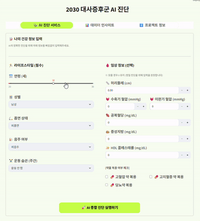
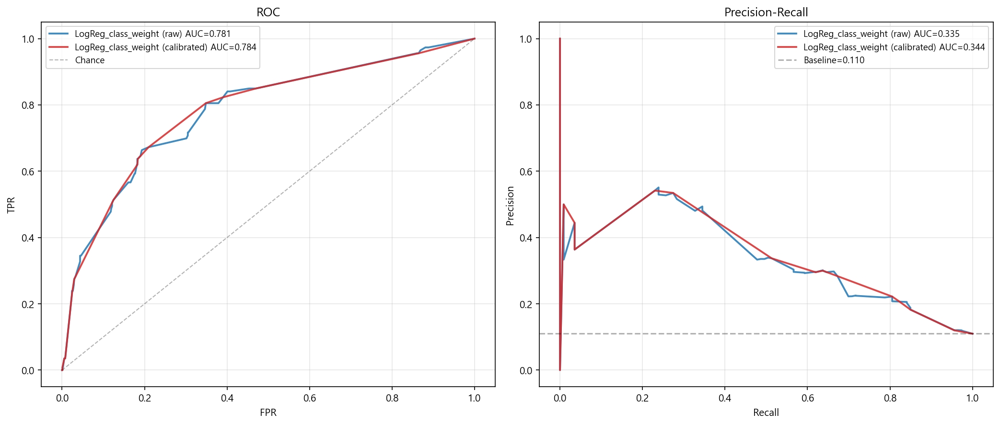
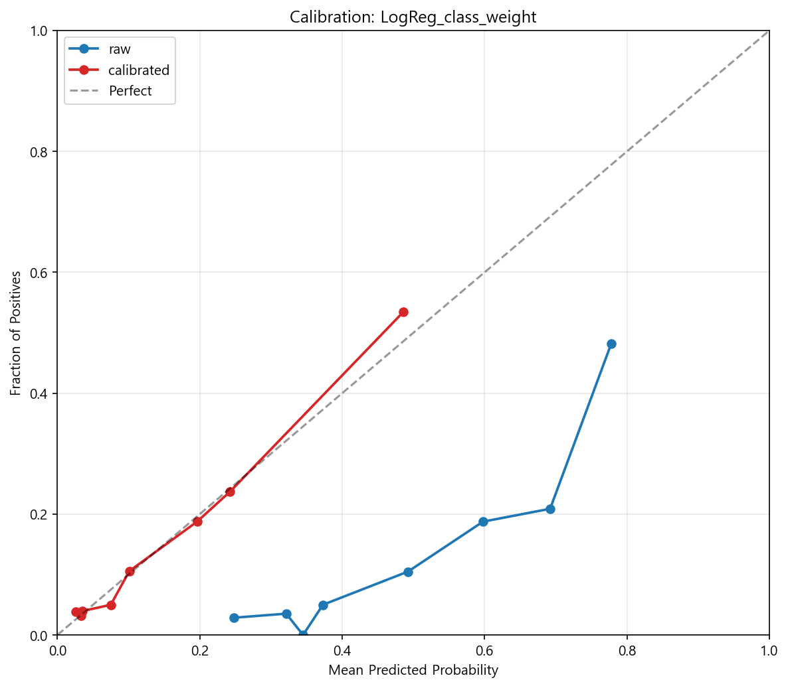
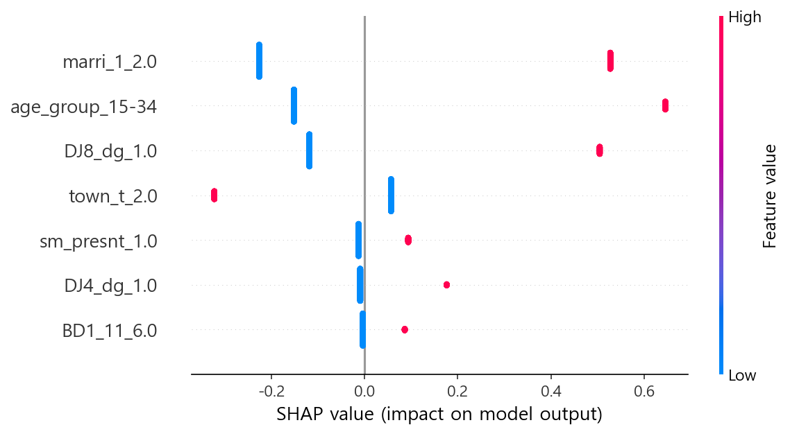
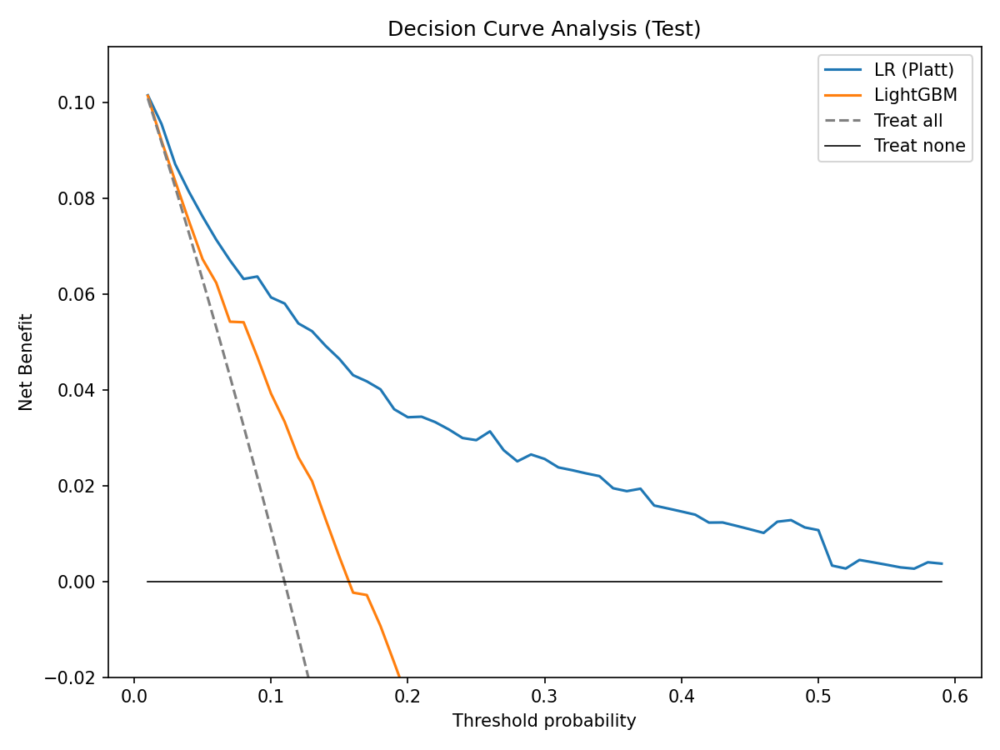
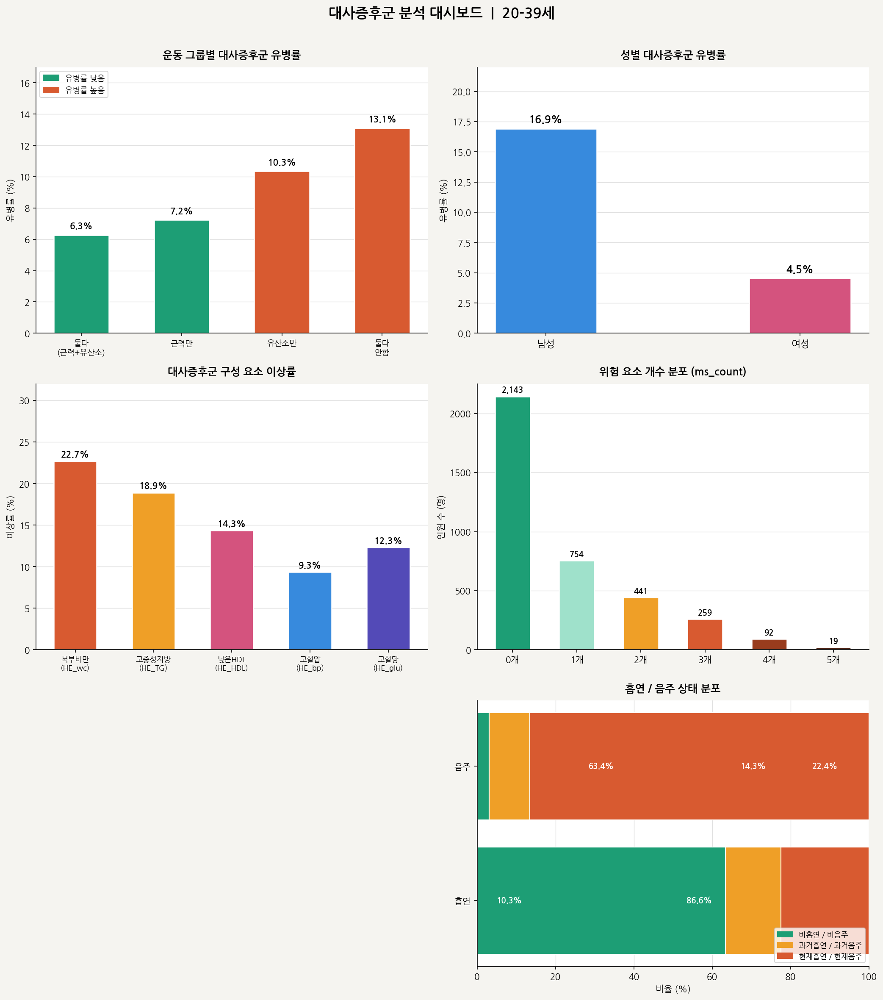

# 2030 대사증후군 예측 AI 진단 시스템

국민건강영양조사(KNHANES 제9기) 데이터 기반 **20~39세 청년층 대사증후군 예측 모델 + Streamlit 자가진단 앱**.

**최종 모델**: Tuned Logistic Regression + Isotonic Calibration
**핵심 성과**: 혈액검사 없이 **생활습관 5개 변수만으로** 대사증후군 환자 **69.2% 탐지** (검증셋 65명 중 45명, FN=20)

---

## 📊 핵심 결과 (Headline Metrics)

### Final Model 성능 (검증셋 N=538, 유병률 12.1%)

| 지표 | 값 | 비고 |
|---|---|---|
| **ROC-AUC** | **0.7347** | 5개 모델 중 1위 |
| **Recall (Sensitivity)** | **0.6923** | 환자 65명 중 45명 탐지 |
| **F1-Score** | **0.3409** | 튜닝 후 (튜닝 전 0.3285) |
| **Brier Score** | 0.2006 | Isotonic 보정 |
| **가중 AUC** | 0.7323 | 복합표본 가중치 반영 (모집단 일반화 ✅) |

### 5개 모델 비교 (Isotonic Calibration 기준)

| 모델 | ROC-AUC | Recall | F1 | Brier |
|---|---|---|---|---|
| **M1: Logistic** ⭐ | **0.7347** | **0.6923** | **0.3285** | 0.2002 |
| M5: CatBoost | 0.7065 | 0.6000 | 0.3264 | 0.1878 |
| M2: RandomForest | 0.7051 | 0.5692 | 0.3274 | 0.1888 |
| M4: LightGBM | 0.6954 | 0.4769 | 0.2897 | 0.1878 |
| M3: XGBoost | 0.6891 | 0.4769 | 0.2884 | 0.1877 |

> **선정 근거**: 스크리닝 목적상 Recall 최우선. 핵심 3개 지표(AUC·Recall·F1) 모두 1위인 Logistic 채택.

### 통계 분석 핵심 결론 (3-Step Hierarchical GLM, 복합표본 가중치)

| 변수 | 남성 OR [95% CI] | 여성 OR [95% CI] | 전체 OR [95% CI] |
|---|---|---|---|
| 병행 운동 (유산소+근력) ⭐ | **0.394** [0.265, 0.586] | **0.205** [0.076, 0.555] | **0.363** [0.259, 0.509] |
| 현재 흡연 | 1.510 [1.091, 2.090] | **3.300** [1.850, 5.888] | 1.799 [1.366, 2.370] |
| 연령 (1세↑) | 1.130 | 1.100 | 1.118 |

> **핵심 인사이트**:
> - **병행 운동의 보호 효과는 여성(-79.5%)이 남성(-60.6%)보다 강함**
> - **흡연 위험은 여성(OR=3.3)이 남성(OR=1.5)의 2.2배**
> - 모든 p<0.001 — 결과의 강건성(Robustness) 입증

### 🎬 Streamlit 앱 시연



### ROC / PR Curve



### Calibration Curve



### SHAP Summary (Feature Contribution)



### Decision Curve Analysis (Net Benefit)



### EDA 대시보드



---

## 📌 프로젝트 개요

대사증후군은 중년 이후 질환으로 인식되지만, 최근 2030 세대 유병률이 빠르게 증가하고 있습니다. 본 프로젝트는 청년층 데이터를 표적화하여 **조기 위험군 식별 모델**을 구축하고, 일반 사용자가 자가진단할 수 있는 인터페이스를 제공합니다.

**데이터**: KNHANES 제9기, N=2,690 (20~39세, 약물 보정 포함 / 시나리오 B)
**클래스**: 대사증후군 1 (12.1%) vs 정상 0 (87.9%) — 불균형 데이터

## 📂 파일 구성

| 파일 | 역할 |
|---|---|
| `01_데이터전처리.py` | KNHANES 원본 → 분석용 데이터셋 (약물 보정) |
| `02_검정통계표.py` | 가중치 적용 기술통계 / t-test, chi-square |
| `03_머신러닝모델링.py` | 5개 모델 학습·평가·SHAP·DCA |
| `04_Streamlit앱.py` | 자가진단 웹 앱 (Plotly 시각화) |

> ※ 원본 파일명은 `(제출용)` 접두사 — 위 이름은 권장 리네이밍

## 🔬 분석 파이프라인

1. **데이터 전처리**: 20~39세 필터링 → 가중치 정규화 → 약물 보정(고혈압·이상지질혈증·당뇨 진단/투약) → 윈저화(1%) → z-score 표준화
2. **3-Step 계층적 GLM**: 연령 → 흡연·음주 추가 → 운동 추가 (성별 구분 + 통합)
3. **모델 학습**: SMOTE 오버샘플링(학습셋 3,782) → 5개 모델 동일 조건 학습 (`RANDOM_STATE=42`)
4. **보정(Calibration)**: Raw / Sigmoid(Platt) / Isotonic 비교
5. **평가**: ROC AUC, PR AUC, Accuracy, Precision, Recall, F1, Brier
6. **임상 활용성**: DCA (Decision Curve Analysis) Net Benefit
7. **해석**: SHAP Summary + Feature Importance (정규화)
8. **하이퍼파라미터 튜닝**: RandomizedSearchCV (n_iter=30, scoring=roc_auc, cv=5)
   - 최적: `C=0.179, penalty='l2', solver='saga'`
9. **민감도 분석**: 비가중 vs 가중 AUC 비교 (편차 0.0022 < 0.02 ✅)

## 🛠️ 기술 스택

- **데이터/통계**: pandas, numpy, scipy, statsmodels (GLM Binomial, DescrStatsW)
- **머신러닝**: scikit-learn, xgboost, lightgbm, catboost, imbalanced-learn (SMOTE)
- **해석/시각화**: shap, matplotlib, seaborn, plotly
- **웹 앱**: streamlit, streamlit-option-menu

## ▶️ 실행 방법

```bash
# 1. 의존성 설치
pip install pandas numpy scipy statsmodels scikit-learn xgboost lightgbm catboost imbalanced-learn shap plotly streamlit streamlit-option-menu

# 2. 데이터 준비 후 전처리
python "01_데이터전처리.py"   # data/hn_all.csv → data/0325_hn_all(med).csv

# 3. 통계표 & 모델링
python "02_검정통계표.py"
python "03_머신러닝모델링.py"

# 4. Streamlit 앱 실행
streamlit run "04_Streamlit앱.py"
```

## 📊 사용 변수 (5개 생활습관 변수)

| 변수 | 코드 | 형태 |
|---|---|---|
| 연령 | `age` | 연속 (20~39) |
| 성별 | `sex` | 1=남, 2=여 |
| 운동 그룹 | `exercise_group` | 1=병행, 2=근력만, 3=유산소만, 4=안함 |
| 흡연 상태 | `smoking_status` | 0=비흡연, 1=과거, 2=현재 |
| 음주 여부 | `drinking_status` | 0=비음주, 1=현재음주 |

**약물 보정 매핑**: `DI1_2`(고혈압 진단), `DI2_2`(이상지질혈증), `DE1_31`(인슐린), `DE1_32`(경구혈당강하제)

## ⚠️ 데이터 출처

본 저장소는 **코드만** 포함합니다. 원본 데이터는 [질병관리청 국민건강영양조사](https://knhanes.kdca.go.kr/)에서 별도 신청·다운로드해야 합니다.

## 📝 한계점 (Limitations)

- **단면 연구** — 인과 추론 불가
- **자가보고 변수** — 운동·흡연·음주 측정 편향 가능성
- **Precision 낮음 (0.23)** — 스크리닝 후 정밀 진단 단계 필요
- **2030 세대 한정** — 타 연령대 일반화 제한

## 📄 Credits

( 팀 프로젝트  / 담당 파트 : DA 데이터 전처리 및 시각화)
